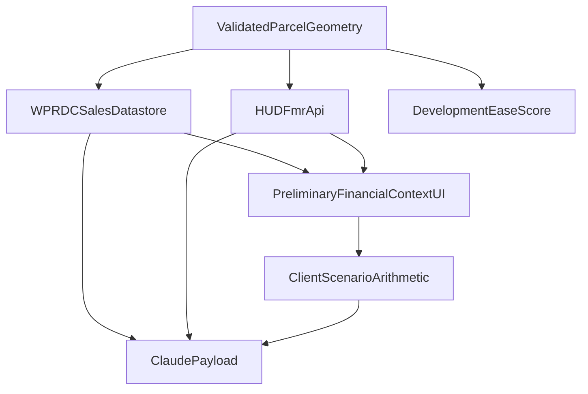

# Preliminary Financial Context — source report (no code yet)

This is the required **before-editing report**. Implementation waits on sale-validation confirmation (see question). BLS PPI stays out. Development Ease Score, Core Evidence Coverage, zoning, hazards, regulatory, historic, and parcel identity stay unchanged. `UNIMPLEMENTED_DUE_DILIGENCE_ITEMS` keeps **financial feasibility** as an unscored due-diligence reminder (this module is parallel context, not a feasibility determination).

## 1. Exact WPRDC sales resource / API

- Dataset: [Allegheny County Property Sale Transactions](https://data.wprdc.org/dataset/real-estate-sales) (`real-estate-sales`, package `9e0ce87d-07b8-420c-a8aa-9de6104f61d6`). Same catalog the current placeholder already links.
- Live datastore (2013–present, updated monthly): resource id `**5bbe6c55-bce6-4edb-9d04-68edeb6bf7b1**`.
- Query (same pattern as permits/assessments):
  - `https://data.wprdc.org/api/3/action/datastore_search`
  - `https://data.wprdc.org/api/3/action/datastore_search_sql`
  - resource metadata: `https://data.wprdc.org/api/3/action/resource_show?id=5bbe6c55-bce6-4edb-9d04-68edeb6bf7b1`
- Confirmed fields from datastore schema: `PARID`, `FULL_ADDRESS`, `PROPERTYHOUSENUM`, `PROPERTYFRACTION`, `PROPERTYADDRESSDIR`, `PROPERTYADDRESSSTREET`, `PROPERTYADDRESSSUF`, `PROPERTYADDRESSUNITDESC`, `PROPERTYUNITNO`, `PROPERTYCITY`, `PROPERTYSTATE`, `PROPERTYZIP`, `SCHOOLCODE`, `SCHOOLDESC`, `MUNICODE`, `MUNIDESC`, `RECORDDATE`, `SALEDATE`, `PRICE`, `DEEDBOOK`, `DEEDPAGE`, `SALECODE`, `SALEDESC`, `INSTRTYP`, `INSTRTYPDESC`.
- **No coordinates** on the sales table. Year built / lot size / use are **not** on this resource; those come from the existing assessment API (`65855e14-549e-4992-b5be-d629afc676fa`: `USEDESC`, `CLASSDESC`, `LOTAREA`, `YEARBLT`) joined by PARID, tagged `PUBLIC_DATA`, never as market value.

## 2. Official validation-code semantics (ambiguity — do not guess)

Official WPRDC/County language:

- `SALECODE` / `SALEDESC`: “subjective categorization … whether or not the sale price was representative of current market value”; codes can change after OPA review.
- Dataset notes: many “sales” are **not** a valid representation of market value; example **code `H` is invalid** because one deed price is written onto multiple PARIDs.
- Assessment data dictionary points to a **“Sale Validation Codes Details” tab of the Property Sale Transaction Data Dictionary**. That dictionary is **not** currently listed as a downloadable resource on the live sales dataset page (only yearly CSVs + the rolling datastore).
- Observed (not used as a valid/invalid map until you approve): sample row `SALECODE=H`, `SALEDESC=MULTI-PARCEL SALE`; dictionary examples `2` / CITY TREASURER, `3` / LOVE&AFFECTION; Kaggle field example `AA` / SALE NOT ANALYZED.
- **Will not use** PA DCED STEB codes (`00` Valid Sale, `01`–`23`, etc.). That is a different statewide submission system, not Allegheny `SALECODE`.

Until the question above is answered, sales filtering is **not implementable without inventing semantics**.

## 3. Nearby-sale selection and radius (after codes are approved)

Proximity uses **existing County parcel geometry** (EPSG:2272 rings already loaded in `lookupSiteEvidence`), **not** a new geocode. Census coordinates are not used as the search origin.

Proposed **BuildWise radius heuristic** (not a County/HUD rule), documented in limitations:

1. Parcel centroid from subject rings in EPSG:2272.
2. Query [Allegheny Parcels MapServer](https://gisdata.alleghenycounty.us/arcgis/rest/services/OPENDATA/Parcels/MapServer/0/query) with a buffer around that geometry: **1,320 ft (0.25 mi)** first; if fewer than 3 validated sales, expand to **2,640 ft (0.5 mi)**. Cap neighbor PINs (e.g. 80) like existing nearby-parcel search.
3. SQL sales for those PARIDs, excluding the subject PIN, applying the **approved** validation filter, `PRICE` present and `> 0` (consideration field; $0 is not a useful recorded price — still not a “valid sale” claim).
4. Prefer **most recent `SALEDATE`**, then closer distance. Lookback **5 years** (implementation choice; labeled as such).
5. Distance: planar centroid-to-centroid feet in EPSG:2272, shown in feet and miles.
6. UI: **3–5** rows, labeled **Nearby Sales Context** / **preliminary candidate comparisons**, never auto-labeled comps or subject value.

If the spatial query or sales API fails: sales = Not Evaluated; HUD and the rest of BuildWise continue.

## 4. Exact HUD FMR / SAFMR source and year

- Authoritative API: HUD User FMR API, base `https://www.huduser.gov/hudapi/public/fmr`, docs [huduser.gov/portal/dataset/fmr-api.html](https://www.huduser.gov/portal/dataset/fmr-api.html). Requires `Authorization: Bearer` token (`HUD_USER_API_TOKEN` in env). No token / HTTP failure → HUD **Not Evaluated** (no Zillow/BLS/asking-rent substitute).
- Geography (most specific reliable):
  1. ZIP from **assessment `PROPERTYZIP`** (parcel fact already in pipeline), not a new geocode.
  2. Request Pittsburgh HUD Metro FMR Area: `**METRO38300M38300**` with `year` omitted so the API returns its **latest published year**, then display that year from the response.
  3. If `smallarea_status` is `1` and `basicdata` is a ZIP array: use the row whose `zip_code` matches the parcel ZIP (SAFMR). Bedroom fields: **Efficiency, One-Bedroom, Two-Bedroom, Three-Bedroom, Four-Bedroom**.
  4. If ZIP is missing from the SAFMR table: show the `**zip_code: "MSA level"**` metro FMR row, labeled as metro-area FMR (not ZIP SAFMR). Do not invent a ZIP rent.
- As of 2026-09-27, HUD documents **FY 2026** FMRs/SAFMRs (and has begun publishing FY 2027 materials). Vintage = whatever year the API returns; UI shows year + ZIP or MSA.
- Compact table labeled **HUD Rent Benchmark**. Disclaimer: regulatory FMR/SAFMR, **not market rent**, not assumed project rent.

## 5. User-input formulas (deterministic, client-side)

No auto-fill of acquisition, hard cost, or rent from HUD or sales. HUD may sit beside expected rent as context only.

Required to emit `SCENARIO_CALCULATED`: acquisition price, units, monthly rent/unit, hard cost, soft cost, contingency (all money fields as **USD totals**; units as count). Optional: other project costs (USD).

- `acquisitionCost = acquisitionPrice` (USER_ASSUMPTION)
- `totalHardCost = hardConstructionCost` (USER_ASSUMPTION)
- `totalSoftCost = softCosts` (USER_ASSUMPTION)
- `contingency = contingency` (USER_ASSUMPTION)
- `otherCosts = otherCosts or 0` (USER_ASSUMPTION)
- `estimatedTotalProjectCost = acquisitionCost + totalHardCost + totalSoftCost + contingency + otherCosts` (CALCULATED_FROM_USER_ASSUMPTIONS)
- `annualGrossScheduledRent = units * monthlyRentPerUnit * 12`
- `projectCostPerUnit = estimatedTotalProjectCost / units` (units > 0)
- `annualGrossRentToCostRatio = annualGrossScheduledRent / estimatedTotalProjectCost` (total > 0)

Show the formula next to each result. **Do not** compute IRR, NPV, cap rate, DSCR, profit, ROI, bankability, or feasible/infeasible.

Status (public lookups independent of score):

- both public sources fail → `FINANCIAL_CONTEXT_NOT_EVALUATED`
- exactly one public source evaluated → `FINANCIAL_CONTEXT_PARTIAL`
- sales + HUD evaluated, no complete scenario → `PUBLIC_MARKET_CONTEXT_AVAILABLE` (empty nearby list still counts as evaluated)
- complete scenario arithmetic → `SCENARIO_CALCULATED` (even if a public source is missing; UI still shows Partial on the failed public layer)
- `FINANCIAL_CONTEXT_NOT_ASSESSED` reserved for “module not run” (should not appear after a successful analysis)

## 6. Files to create / change

Create:

- `[lib/financial/types.ts](lib/financial/types.ts)` — statuses, provenance tags, sales/HUD/scenario types
- `[lib/financial/status.ts](lib/financial/status.ts)` — status resolver
- `[lib/financial/sales.ts](lib/financial/sales.ts)` — WPRDC sales + spatial neighbor join
- `[lib/financial/hud.ts](lib/financial/hud.ts)` — HUD API
- `[lib/financial/scenario.ts](lib/financial/scenario.ts)` — arithmetic only (shared UI + tests)
- `[lib/financial/index.ts](lib/financial/index.ts)` — `lookupFinancialContext`
- `[lib/financial/run-status-tests.ts](lib/financial/run-status-tests.ts)`
- `[lib/financial/run-live-acceptance.ts](lib/financial/run-live-acceptance.ts)` — 5061 5th + 414 Grant; assert PIN unchanged

Change:

- `[lib/lookup/address-to-parcel.ts](lib/lookup/address-to-parcel.ts)` — parallel financial lookup with independent catch; **do not** pass financial result into `buildDecisionSnapshot`
- `[components/financial-feasibility.tsx](components/financial-feasibility.tsx)` — replace placeholder with the five-part UI
- `[components/feasibility-snapshot.tsx](components/feasibility-snapshot.tsx)` — pass financial result + Sources rows; keep score UI untouched
- `[lib/claude/types.ts](lib/claude/types.ts)`, `[lib/claude/payload.ts](lib/claude/payload.ts)`, `[lib/claude/chat.ts](lib/claude/chat.ts)`, `[components/ask-buildwise-ai.tsx](components/ask-buildwise-ai.tsx)` — public sales/HUD as `PUBLIC_DATA`; scenario only if user entered (`USER_ASSUMPTION` / `CALCULATED_FROM_USER_ASSUMPTIONS`); Claude must not invent rents/costs or declare feasibility
- `[lib/review/next-steps.ts](lib/review/next-steps.ts)` — financial verification bullets only if needed; do not change scoring flags
- `[.env.local](.env.local)` / env reader — `HUD_USER_API_TOKEN` (do not commit secrets)

Do **not** edit `[lib/scoring/config.ts](lib/scoring/config.ts)` weights.

## After you approve validation + this plan

Implement, then run `tsc --noEmit`, existing identity/scoring/regulatory/historic tests, new financial status tests, live 5061 5th / 414 Grant, manual scenario arithmetic, and a browser check. Stop after this feature.