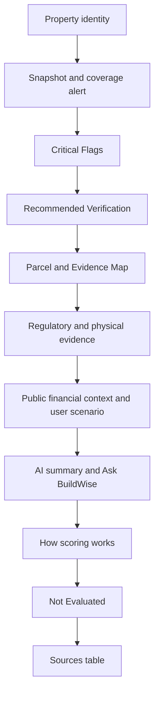

# Result hierarchy polish

The current result in `[components/feasibility-snapshot.tsx](components/feasibility-snapshot.tsx)` already has the right evidence. It is long because identity, score methodology, flags, and verification sit far apart. The polish should reorder and tighten that UI. It should not author new conclusions.

## Necessary adjustments to the brief

These are the only changes to the proposed plan. Everything else in the brief stands.

- **Do not write a “What matters most” digest.** `[lib/review/next-steps.ts](lib/review/next-steps.ts)` always returns a long deterministic list, including “not evaluated,” “absence is not proof,” and the MVP due-diligence close. Picking three paraphrased bullets is new decision logic and would drop those caveats. Move the existing **Critical Flags** and **Recommended Verification** blocks up, unchanged, instead of summarizing them.
- **Keep the Census matched address as the title.** Screening is attached to the PARID resolved from that match. The county assessment address is sometimes house number `0` and is not the match key. Show proposed housing and PARID beside the title. Put entered, Census, and assessment addresses in **Parcel identity details**. If the three street keys differ, or the county house number is `0`, leave that warning outside the disclosure.
- **Do not replace Sources with Methodology in the global nav.** `[components/site-header.tsx](components/site-header.tsx)` already links Home, Analyze, How It Works, About, and Sources. There is no Methodology page. Keep that nav. After a result exists, add an in-flow jump row only: Snapshot, Map, Zoning, Site Conditions, Regulatory, Financial, AI, Scoring, Gaps, Sources. Do not add a second sticky bar under the existing sticky header.
- **Resolve the AI / financial order conflict in favor of the current data flow.** Public sales and HUD stay with evidence. The user scenario stays above Ask BuildWise, because `[FinancialContextWithChat](components/financial-feasibility.tsx)` passes the live scenario into chat via `withFinancialScenario`. Place the AI Feasibility Summary immediately before Ask BuildWise, after that scenario, so both are labeled interpretation and the chat wiring stays the same.
- **Do not collapse a source into “Updated {date}.”** Cards already separate dataset last modified from retrieval time. A single “Updated” date would merge them. Visible footer: source name, dataset last modified (or “not reported”), and the existing dataset link. Retrieval time, endpoint, CRS, and join/transform go in **Source details**. The 2014 flood-extract caveat stays outside that disclosure.
- **Do not strip precise use-table evidence.** Human badges already exist (`Permitted by Right`, `Requires Review`). Keep the § 911.02 symbol (`P` / `A` / `S` / `C`) on the zoning card. Replace raw enum badges elsewhere with labels that already exist (`overallStatusLabel`, `FINANCIAL_CONTEXT_LABELS`, `REGULATORY_SCREENING_LABELS`). Accent teal (`#1b4f4a`) is not a success green; still use it for actions and links, not for “Evaluated” or “no intersection.”
- **Leave the sources table and the bottom gaps list open.** Card metadata can collapse because `[Sources & Assumptions](components/feasibility-snapshot.tsx)` still shows steward, finding, join, vintage, and limitation. The unimplemented due-diligence list in `EvidenceGapsCard` stays visible once, near the bottom. Keep each card’s own finding-specific caveat (zoning is not an entitlement, missing hazard is not a clear site, flood vintage, historic partial evidence). Remove only repeated copies of the same global MVP list.
- **Do not shrink permit/violation previews.** The first five rows already show, with the rest in `
`. If that preview is touched, keep every `UNRESOLVED` and `REQUIRES_VERIFICATION` row in the visible set and show the review class as words (“Unresolved”, “Requires verification”), not the enum.

## Page hierarchy

Landing, unchanged in structure: hero, analyze form, How It Works, About, Sources.

After a successful lookup:

1. Property identity (matched address, housing type, PARID; mismatch warning when needed)
2. Four snapshot cards, plus the existing two-line Regulatory Fit / Physical Site breakdown
3. Incomplete-evidence alert when coverage is already below the current thresholds
4. Critical Flags (full finding, why it matters, verification)
5. Recommended Verification (full list)
6. Parcel & Evidence Map
7. Regulatory Fit: zoning, historic, regulatory records
8. Physical Site: steep slope, landslide, mine, flood (flood content unchanged, including vintage)
9. Preliminary Financial Context, then Quick Development Scenario
10. AI Feasibility Summary, then Ask BuildWise AI
11. How scoring works (existing copy and weights; no formula edits)
12. Not Evaluated / further due diligence
13. Sources & Assumptions, then property facts

## Components

Refactor in place. No new routes, datasets, score rules, prompts, or map behavior.

- `[components/landing-sections.tsx](components/landing-sections.tsx)`: shorter hero. Keep the current headline, logo, and disclaimer. Mention parcel, zoning, mapped constraints, regulatory records, market context, and grounded AI in one sentence.
- `[components/find-parcel-form.tsx](components/find-parcel-form.tsx)`: tighter form spacing and the Pittsburgh-address hint. Keep the existing loading stages and address-resolution behavior.
- `[components/feasibility-snapshot.tsx](components/feasibility-snapshot.tsx)`: reorder sections, add the jump row and section ids, compact identity disclosure, shared source footer, and badge labels. Add only presentational helpers in this file or a small sibling such as `components/result-chrome.tsx`.
- `[components/status-badge.tsx](components/status-badge.tsx)`: one size, radius, and type scale. Tones stay neutral, review, and alert. No success color.
- `[components/financial-feasibility.tsx](components/financial-feasibility.tsx)` and `[components/ask-buildwise-ai.tsx](components/ask-buildwise-ai.tsx)`: visual grouping only. Provenance badges already say Public data / Assumption / Calculated; keep the raw provenance value on `data-provenance` and the tooltip. Scenario math, Reset, and live `onChange` stay. There is no Calculate button to remove.
- `[components/site-header.tsx](components/site-header.tsx)`: leave the landing anchors as they are.

## Collapsible vs always visible

Collapsible: agreeing address strings; endpoint, retrieval timestamp, CRS, and join; permit/violation rows after the current preview; AI limitation paragraph only if the summary headings above it stay open.

Always visible: matched address, housing type, PARID, and any address mismatch; four metrics and the two score lines; coverage alert; every critical flag; every recommended verification step; Not Evaluated and Review Required states; flood vintage; card-level caveats that change the meaning of that card; the bottom due-diligence list; the sources table.

## Checks after implementation

`npm run build`, `npx tsc --noEmit`, and lint. Then exercise one completed result at 1440, 1024, 768, and 390: jump links, disclosures, map, stacked cards, and table scroll. No `lib/` scoring, zoning, hazard, regulatory, financial, parcel, or Claude files change.